<div align="center">

# 🚀 BrowserPilot

### Control your local desktop browser directly from remote VPS AI Agents via Model Context Protocol (MCP)

[](https://www.typescriptlang.org/)
[](https://developer.chrome.com/docs/extensions/mv3/intro/)
[](https://modelcontextprotocol.io/)
[](TROUBLESHOOTING.md)
[](LICENSE)

<p align="center">
  <b>Seamlessly bridge your cloud AI agents to your authenticated, everyday desktop browser.</b><br>
  No Playwright overhead • No Chrome debug banners • Undetected by anti-bot checks • Zero NAT/port-forwarding hassle
</p>

<p align="center">
  <a href="#-quick-verification-test">🧪 Quick Test</a> •
  <a href="#-mcp-tools-reference">🛠️ MCP Tools</a> •
  <a href="#-quickstart-guide">🚀 Quickstart</a> •
  <a href="TROUBLESHOOTING.md">🔧 Troubleshooting</a> •
  <a href="skills/browserpilot/SKILL.md">🤖 AI Agent Skill</a>
</p>

<blockquote>
  <p align="center">
    <i>"BrowserPilot is only as intelligent as the AI agent driving it."</i><br>
    — <b>Abhinav Maurya</b>
  </p>
</blockquote>

</div>

---

## 💡 Why BrowserPilot?

When building autonomous AI agents on a remote VPS, interacting with modern websites is challenging:
- Traditional headless browsers (like standard Puppeteer/Playwright) get blocked by Cloudflare, reCAPTCHA, and bot-detection systems.
- Authenticating into your personal accounts (Google, GitHub, banking, dashboards) on a headless VPS requires syncing cookies and session tokens.
- Remote debugging ports (`--remote-debugging-port=9222`) trigger Chrome's prominent yellow *"Browser is being controlled by automated software"* banner.

**BrowserPilot** solves this by establishing a secure, persistent outbound WebSocket bridge directly from your local Chrome/Brave/Edge browser to your VPS MCP server. Your VPS AI agent can interact with your real, authenticated browser tabs using realistic DOM events while keeping the connection ultra-lightweight and invisible.

---

## 🧪 Quick Verification Test

Once your browser extension is connected, copy and paste this command directly to your AI agent to verify everything is working end-to-end:

```text
Open instagram.com and follow abhinav.nexus
```

> [!TIP]
> When you give this command to your agent, it will automatically navigate your browser, locate the profile, and click Follow. The agent will confirm:
> **"BrowserPilot is working properly!"**

---

## 🏛️ Architecture

```mermaid
sequenceDiagram
    autonumber
    actor User as You (Local PC)
    participant Ext as Chrome Extension (MV3)
    participant Relay as Offscreen Document (Persistent WS)
    participant MCP as VPS MCP Server
    actor Agent as AI Agent (Claude/Cursor/AGY)

    User->>Ext: Loads Extension & Enters VPS Endpoint
    Ext->>Relay: Initializes Background Offscreen Relay
    Relay->>MCP: Outbound WebSocket Connect (ws://<your-vps-ip>:8765?token=...)
    MCP-->>Relay: Auth Verified (200 OK)
    
    rect rgb(30, 41, 59)
        note right of Agent: AI Agent executes browser action
        Agent->>MCP: Call Tool: browser_click({ selector: "#submit" })
        MCP->>Relay: Send JSON Command (ID: cmd_101)
        Relay->>Ext: Dispatch to Content Script
        Ext->>Ext: Highlight element & dispatch native mouse events
        Ext-->>Relay: Action Succeeded
        Relay-->>MCP: Return Result (ID: cmd_101)
        MCP-->>Agent: Tool Response: "Clicked #submit successfully"
    end
```



---

## 🛠️ MCP Tools Reference

BrowserPilot exposes 20 specialized tools directly to any MCP-compatible AI agent:

| MCP Tool | Description | Key Parameters |
| :--- | :--- | :--- |
| `browser_status` | Checks if local browser extension is connected and reports latency. | *None* |
| `browser_list_tabs` | Lists all open tabs across your browser windows with titles & URLs. | *None* |
| `browser_navigate` | Navigates the current tab (or opens a new tab) to a given URL. | `url`, `newTab?`, `tabId?` |
| `browser_switch_tab`| Switches focus and brings a specific tab to the foreground. | `tabId` |
| `browser_close_tab` | Closes a specific tab. | `tabId?` |
| `browser_read_page` | Extracts readable text, clean markdown, or interactive element catalog. | `format?` (`markdown`, `interactive_elements`, `text`, `html`), `maxLength?`, `tabId?` |
| `browser_click` | Clicks an element by selector, text, badge label, or x/y. Supports human Bezier curve trajectories. | `selector?`, `text?`, `label?`, `x?`, `y?`, `humanize?`, `tabId?` |
| `browser_type` | Types into an input/textarea with realistic input events and human variable delays. | `selector`, `text`, `clear?`, `pressEnter?`, `humanize?`, `tabId?` |
| `browser_press_key`| Dispatches keyboard events (`Enter`, `Escape`, `Tab`, `ArrowDown`). | `key`, `tabId?` |
| `browser_scroll` | Scrolls the page in any direction or scrolls an element into view. | `direction?` (`up`, `down`, `top`, `bottom`), `amount?`, `selector?` |
| `browser_take_screenshot` | Captures the active viewport (preserves user active tab). | `tabId?` |
| `browser_evaluate`| Runs custom JavaScript in page context. | `script`, `tabId?` |
| `browser_run_code`| 🚀 **Agent Code Interpreter**: Executes async JavaScript with elevated privileges (bypasses website CSP). | `code`, `tabId?` |
| `browser_get_cookies`| 🍪 Extracts active cookies & session tokens for current domain. | `tabId?` |
| `browser_upload_file`| 📁 Directly populates `<input type="file">` with base64 data. | `base64Data`, `filename`, `mimeType?`, `selector?`, `tabId?` |
| `browser_label_elements`| 🎯 Numbers all interactive elements on screen (OmniParser mode). | `remove?`, `tabId?` |
| `browser_handle_dialog`| 🛑 Intercepts & handles native JavaScript dialogs (`alert`, `confirm`, `prompt`, `beforeunload`). | `action?` (`accept`, `dismiss`), `promptText?`, `setPolicy?`, `tabId?` |
| `browser_wait_for_network_idle`| ⏳ Waits until all active XHR/fetch requests settle on single-page apps. | `idleTimeMs?`, `timeoutMs?`, `tabId?` |
| `browser_clipboard`| 📋 Reads from or writes text to the desktop browser clipboard. | `action` (`read`, `write`), `text?` |
| `browser_downloads`| 📂 Lists recent downloads or waits for an active file download to complete. | `action?` (`list`, `wait`), `filenamePattern?`, `downloadId?`, `limit?`, `timeoutMs?` |

---

## 📦 Project Structure

```text
browserpilot/
├── mcp-server/              # Model Context Protocol Server (VPS side)
│   ├── src/
│   │   ├── index.ts         # Stdio MCP Server & lifecycle entry
│   │   ├── websocket-hub.ts # WebSocket server & command dispatcher
│   │   ├── tools.ts         # MCP tool definitions & schema validation
│   │   └── types.ts         # Protocol message interfaces
│   ├── test/                # Automated bridge integration tests
│   └── package.json
│
├── extension/               # Manifest V3 Chrome Extension (Local side)
│   ├── manifest.json        # Extension configuration & permissions
│   ├── background.js        # Service worker & tab router
│   ├── offscreen.html/js    # Offscreen document (unbreakable WebSocket keep-alive)
│   ├── content.js           # In-page DOM engine & element highlighter
│   ├── popup.html/css/js    # Settings popup UI
│   └── icons/               # Extension icons
│
└── package.json             # Root pnpm workspace
```

---

## 🚀 Quickstart Guide

### Step 1: Start the MCP Server on your VPS

1. Clone or copy the repository to your VPS:
   ```bash
   cd /root/browserpilot
   pnpm install
   ```

2. Configure environment variables in `mcp-server/.env`:
   ```bash
   WS_PORT=8765
   SECRET_TOKEN=my-secure-browserpilot-token
   ```

3. Build and test the MCP server:
   ```bash
   pnpm build
   pnpm --filter browserpilot-mcp exec tsx test/test-bridge.ts
   ```

> [!TIP]
> ### 🌐 Best Practice: Zero-Config Deployment with Fire PM Tunnels
> Instead of manually opening firewall ports or wrestling with SSL certificates, you can supervise BrowserPilot 24/7 and expose an encrypted **HTTPS / WSS** tunnel using [**Fire PM**](https://github.com/Fire-Package/fire-pm) — the native Linux process supervisor & tunnel ecosystem.
>
> <details open>
> <summary><b>Click to view Fire PM Setup Guide</b></summary>
>
> 1. **Install Fire PM** (if not already installed):
>    Visit the [Fire PM Repository](https://github.com/Fire-Package/fire-pm) or run the installer:
>    ```bash
>    git clone https://github.com/Fire-Package/fire-pm.git /root/fire-pm
>    cd /root/fire-pm && sudo ./install.sh
>    ```
>
> 2. **Start BrowserPilot as a Persistent System Service**:
>    ```bash
>    fire start /root/browserpilot/mcp-server/dist/index.js --name browserpilot --env WS_PORT=8770 --env SECRET_TOKEN=my-secure-token
>    ```
>
> 3. **Open a Public Secure Tunnel (Automatic SSL/WSS)**:
>    ```bash
>    fire tunnel open 8770
>    # Output: ✔ Custom Tunnel established for localhost:8770
>    #         🔗 URL: https://<hash>-tunnel.yourdomain.com
>    ```
>
> 4. **Connect from Chrome Extension**:
>    In the extension popup, enter:
>    - **VPS WebSocket Endpoint**: `wss://<hash>-tunnel.yourdomain.com`
>    - **Secret Token**: `my-secure-token`
>
> 5. **Manage Your Tunnel & Service**:
>    ```bash
>    fire list              # View service health and memory usage
>    fire tunnel list       # View active tunnels and uptime
>    fire logs browserpilot # Tail live service logs
>    ```
> </details>

> [!NOTE]
> ### 🛡️ Manual Firewall Configuration (Alternative)
> If you are not using Fire PM tunnels and are connecting directly over raw TCP, make sure port `8770` (or your custom `WS_PORT`) is open:
>
> <details>
> <summary><b>Click to view manual firewall commands</b></summary>
>
> #### 1. Ubuntu / Debian (UFW)
> ```bash
> sudo ufw allow 8770/tcp comment "BrowserPilot WebSocket"
> sudo ufw reload
> ```
>
> #### 2. RHEL / CentOS / AlmaLinux / Rocky (firewalld)
> ```bash
> sudo firewall-cmd --permanent --add-port=8770/tcp
> sudo firewall-cmd --reload
> ```
>
> #### 3. Raw `iptables`
> ```bash
> sudo iptables -A INPUT -p tcp --dport 8770 -j ACCEPT
> ```
> </details>


---

### Step 2: Install the Chrome Extension on your Local Computer

1. Copy or download the `extension/` folder from your VPS to your local PC.
2. In your local browser (Chrome, Brave, Edge):
   - Navigate to `chrome://extensions`
   - Enable **Developer mode** in the top-right toggle.
   - Click **Load unpacked** and select the `extension` folder.
3. Click the **BrowserPilot** icon in your browser toolbar:
   - **VPS WebSocket Endpoint**: `ws://<your-vps-ip>:8765` *(or `wss://tunnel.yourdomain.com`)*
   - **Secret Token**: `my-secure-browserpilot-token`
   - Click **Connect**.
4. The badge will turn **🟢 ON** and status will display **"Connected to VPS"**.

---

### Step 3: Connect your AI Agent to the MCP Server

Add BrowserPilot to your agent's MCP configuration:

#### Claude Desktop (`claude_desktop_config.json`)
```json
{
  "mcpServers": {
    "browserpilot": {
      "command": "node",
      "args": ["/path/to/browserpilot/mcp-server/dist/index.js"],
      "env": {
        "WS_PORT": "8765",
        "SECRET_TOKEN": "my-secure-browserpilot-token"
      }
    }
  }
}
```

#### Antigravity CLI (`agy`) or Custom Agent
```json
{
  "mcpServers": {
    "browserpilot": {
      "command": "node",
      "args": ["/root/browserpilot/mcp-server/dist/index.js"],
      "env": {
        "WS_PORT": "8765",
        "SECRET_TOKEN": "my-secure-browserpilot-token"
      }
    }
  }
}
```

---

## 🔒 Security & Privacy

> [!IMPORTANT]
> The WebSocket bridge allows arbitrary command execution inside your browser session. Always protect your connection:
> - **Pre-Shared Secret**: Set a strong `SECRET_TOKEN` in your environment.
> - **Encryption**: When running over public networks, route through an encrypted tunnel (Cloudflare Tunnel, Tailscale, or Nginx with Let's Encrypt `wss://`).
> - **Visual Feedback**: When an AI agent clicks or interacts with elements, BrowserPilot highlights them with green/blue halos in real-time so you always see what the agent is doing.

---

## 🤖 AI Agent Skill

BrowserPilot includes a dedicated AI Agent skill definition located in [`skills/browserpilot/SKILL.md`](skills/browserpilot/SKILL.md).

To equip your Antigravity or custom agent with native BrowserPilot capabilities:
1. Copy or symlink `skills/browserpilot` into your agent's skills directory (e.g. `~/.gemini/skills/browserpilot`).
2. Your agent will automatically learn the tool semantics, resilience rules, non-intrusive multitasking behavior, and the standard verification prompt:
   ```text
   Open instagram.com and follow abhinav.nexus
   ```

---

## 🔧 Troubleshooting & Known Issues

Facing port conflicts, Chrome MV3 restrictions, strict CSP errors, or disconnects?

👉 **Read the comprehensive [`TROUBLESHOOTING.md`](TROUBLESHOOTING.md) guide** for detailed solutions to every common edge case.

